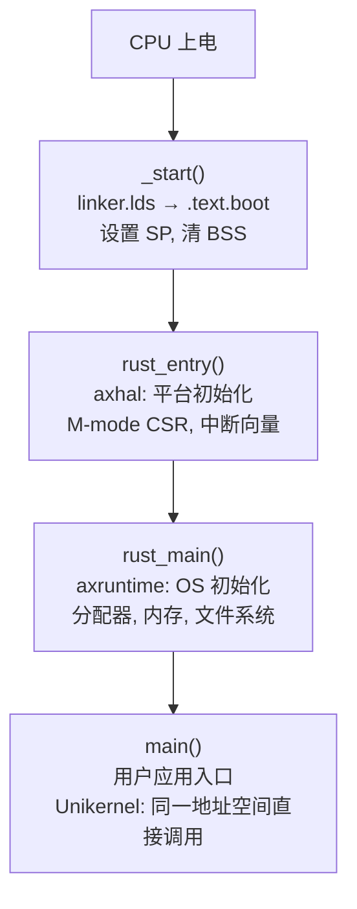
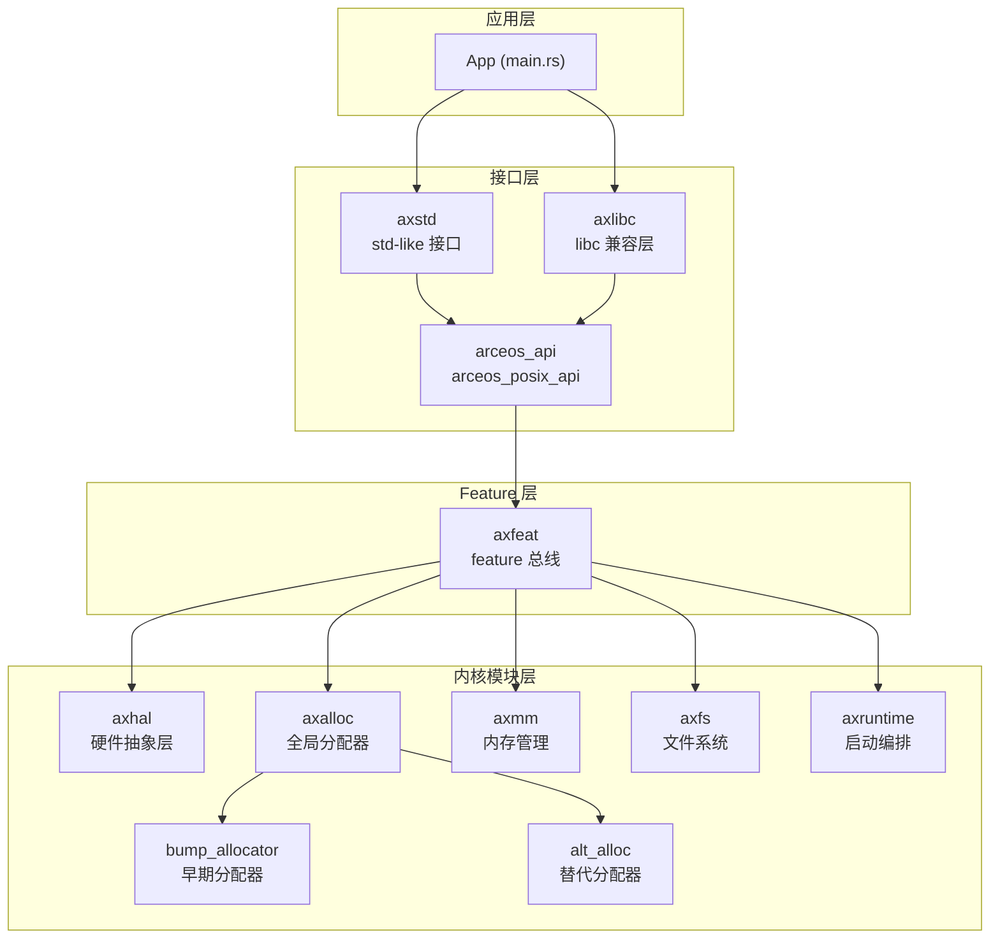
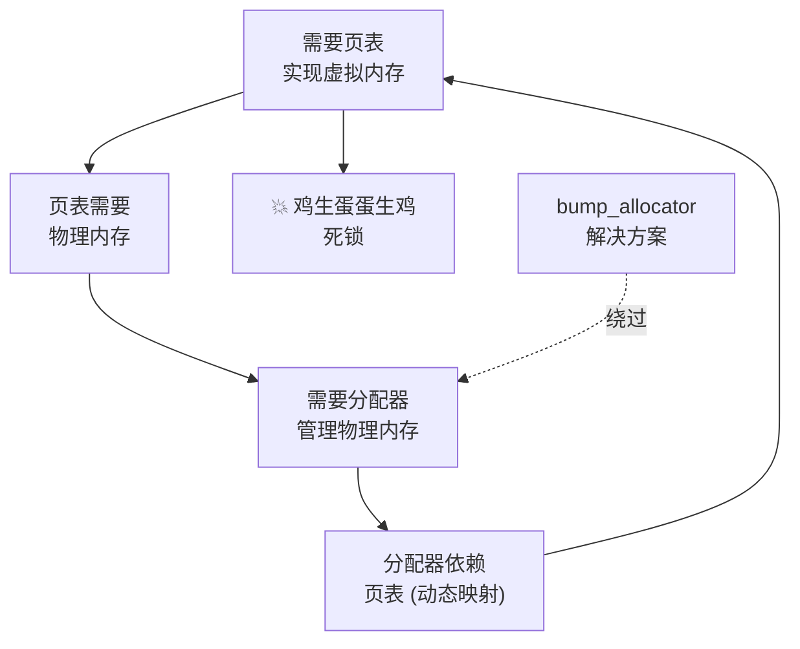
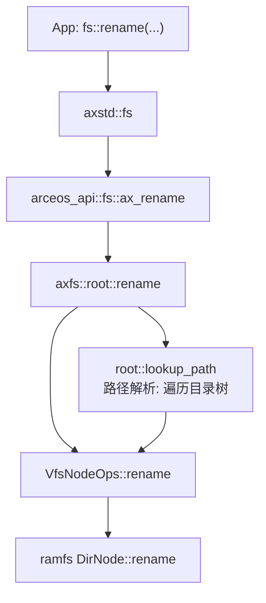
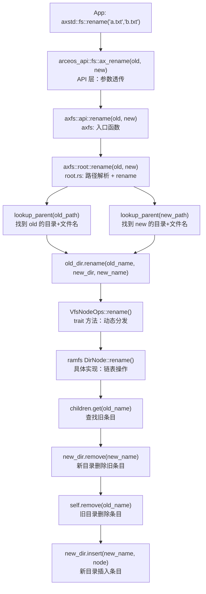

# 示例：ArceOS 启动过程分析

> **场景：** 用户第一次接触 ArceOS（Rust Unikernel for RISC-V），面对一个陌生的 OS 代码库，完全不知道从哪里开始分析
>
> **对应 skill 版本：** v1
>
> **认知框架主轴：** 视域层整体观建立全局场 → 引擎层格物致知追踪启动代码 → 视域层整体观建立架构心智模型 → 引擎层第一性原理深入模块设计 → 收束层实践论全链路验证 → 收束层辩证法反思总结方法论
>
> **关键词：** ArceOS, Unikernel, 启动过程, Makefile 分析, linker script, _start, 格物致知, bump_allocator, axhal, axmm, axfs, syscall tracing, 整体观, 第一性原理

---

## 摊开：从哪里入手？

**[视域层·整体观]**

---

**用户：**

师兄，我最近要啃 ArceOS 这个项目。它是一个 Rust 写的 Unikernel，跑在 RISC-V 上。我打开代码目录，一堆 module，不知道该从哪里开始。怎么入手？

**师兄：**

不急。先把项目摊开，不要一上来就钻进某个文件里。面对任何一个新项目，第一步永远是建立**全局场**——你要先回答一个最基本的问题：这个东西是怎么从源码变成可运行的程序的？

[事实] ArceOS 在 GitHub 上是一个完整的 Rust workspace，根目录有顶层 Cargo.toml 和 Makefile。

[推断] 所有 OS 项目的分析入口不外乎两条路：

1. **构建系统** — 从 Makefile / Cargo.toml 理解编译链路，知道哪些模块参与编译、如何组织
2. **链接脚本** — 从 linker script 找到第一个执行的指令，追踪启动流

> ArceOS 不是大项目也不是中型项目。对于这种体量的项目，直接从构建系统入手是最有效的方法——你不会在模块依赖的迷宫里迷路。先把编译关系画出来，你知道"谁依赖谁"，心智模型就建立了一半。

我们先看 Makefile。ArceOS 的构建使用 `scripts/make/` 下的多个 .mk 文件。

---

## 构建系统分析

**[引擎层·格物致知]**

---

**师兄：**

第一步不猜，直接读。打开 Makefile 和核心构建脚本，看它到底干了什么。

```bash
# 项目根目录
ls scripts/make/
# 输出: build.mk  cargo.mk  features.mk  ...
```

**用户：**

文件不少。从哪里开始？

**师兄：**

从入口开始。主 Makefile 里的 build 目标一定会走到 `scripts/make/build.mk`。

看 `build.mk` 中的 `_cargo_build` 目标：它根据 `APP_TYPE` 决定编译方式——`rust` 还是 `c`。ArceOS 是 Unikernel，应用和内核编在一起。

```makefile
# scripts/make/build.mk (简化)
_cargo_build:
	$(call cargo_build,$(APP),$(AX_FEAT),$(APP_TYPE))
```

这个 `cargo_build` 函数定义在 `cargo.mk` 里——本质就是对 `cargo build` 的一层包装，带上 features。

**用户：**

那 features 是怎么选的？ArceOS 有那么多模块（axhal, axalloc, axmm...），怎么控制哪些模块参与编译？

**师兄：**

这个问题问在了关键位置。[推断] 答案是 `scripts/make/features.mk` 里的 `axfeat` 机制。

`axfeat` 是 ArceOS 的顶层 feature 选择器。你可以理解成一条"feature 总线"——app 通过 feature flags 声明自己需要什么功能，这些 flags 通过 Cargo.toml 的依赖链传递到各个模块。

来看 Cargo.toml 中的特征传递：

```toml
# axstd/Cargo.toml (简化)
[features]
fs = ["arceos_api/fs", "axfeat/fs"]
net = ["arceos_api/net", "axfeat/net"]
multitask = ["arceos_api/multitask", "axfeat/multitask"]
```

[事实] `axstd` 的 `fs` feature 打开了两个东西：`arceos_api/fs` 和 `axfeat/fs`。而 `axfeat/fs` 把 feature flag 进一步传递给下层模块（比如 axfs）。

**用户：**

也就是说，如果一个 app 的 Cargo.toml 里写了 `features = ["fs"]`，那 axfs 模块就会被编进去？

**师兄：**

对。而且这里有一个容易被忽略的关键点：[事实] `modules/` 目录下的模块**不是直接被 cargo 编译的**——它们是被 `axfeat` 作为依赖拉进来的。你如果直接去 `modules/axfs/` 下面跑 `cargo build`，是没有意义的。

验证一下：

```bash
cargo tree -p axstd --features fs 2>/dev/null | head -30
# 输出: axstd -> arceos_api -> axfeat -> axfs ...
# 只有被选中的模块才会出现在依赖树里
```

> 这个认知很重要：在 ArceOS 里，你看 modules/ 目录下有十个模块，但一次编译只涉及你选中的那三四个。哪些模块参与编译，取决于 `axfeat` 的 feature propagation。你需要在看代码的时候时刻提醒自己："我现在是在读死代码，还是活代码？"

**用户：**

明白了。那下一步呢？我大概知道编译链路了，但程序第一条指令在哪里执行？

**师兄：**

问得好。现在从构建系统切到启动流。这是从"编译"到"运行"的桥。

---

## 追踪启动代码

**[引擎层·格物致知]**

---

**师兄：**

追启动流有一个铁律：**从链接脚本开始**。链接脚本决定了程序的布局，而第一条指令总是放在最前面。

```bash
# 找到链接脚本
find . -name "*.lds" -o -name "*.ld"
# 输出: modules/axhal/linker.lds (或者其他路径)
```

打开 `linker.lds`，你会看到类似这样的片段：

```ld
SECTIONS {
    . = BASE_ADDRESS;
    .text : {
        *(.text.boot)      /* <-- 关键 */
        *(.text.text)
        *(.text.*)
    }
    /* ... */
}
```

[事实] `.text.boot` section 被放在 `.text` 的最前面。这意味着 `_start()` 函数的地址就是 BASE_ADDRESS，是 CPU 上电后跳转的第一条指令。

**用户：**

那 `_start()` 在哪？怎么找？

**师兄：**

格物致知——直接在代码里搜。

```bash
grep -r "\.text\.boot" modules/axhal/src/
# 输出: modules/axhal/src/platform/riscv64-qemu-virt/boot.rs
#       #[link_section = ".text.boot"]
```

打开 `boot.rs`：

```rust
// modules/axhal/src/platform/riscv64-qemu-virt/boot.rs
#[naked]
#[link_section = ".text.boot"]
#[export_name = "_start"]
pub unsafe extern "C" fn _start() -> ! {
    // 1. 设置栈指针 (SP)
    // 2. 禁用中断
    // 3. 清空 BSS
    // 4. 启用浮点单元
    // 5. 跳转到 rust_entry()
    core::arch::asm!(
        "la sp, {boot_stack_top}",
        "call {rust_entry}",
        // ...
    )
}
```

[事实] `_start` 是一个 `#[naked]` 函数——没有标准函数前言（prologue），直接内联汇编。它做的事情非常原始：

1. 设 SP 指向启动栈
2. 调 `rust_entry`

**用户：**

然后 `rust_entry` 在哪里？

**师兄：**

继续追。`rust_entry` 通常在同一个文件或 axhal 的某个初始化文件里。

```bash
grep -r "rust_entry" modules/axhal/src/
```

`rust_entry` 完成平台相关初始化（M-mode 设置、中断向量等），最终调用 `rust_main`。

**用户：**

`rust_main` 又在哪？

**师兄：**

```bash
grep -r "fn rust_main" modules/
# 输出: modules/axruntime/src/lib.rs
```

>[事实] `rust_main` 不在 axhal 里，而在 axruntime 里。这说明平台初始化（axhal）和运行时初始化（axruntime）是**解耦**的。axhal 负责"让 CPU 能跑 Rust 代码"，axruntime 负责"让 OS 服务可用"。

打开 `axruntime/src/lib.rs`，你会看到 `rust_main` 的核心流程：

```rust
// modules/axruntime/src/lib.rs (简化)
pub fn rust_main(cpu_id: usize, dtb: usize) -> ! {
    // 1. 初始化分配器
    init_allocator();
    
    // 2. 初始化内存管理
    init_memory_management();
    
    // 3. 初始化文件系统
    init_filesystems();
    
    // 4. 初始化其他子系统...
    
    // 5. 调用应用 main() ← Unikernel 的核心设计！
    main();
    
    // unreachable
}
```

**用户：**

等等——`rust_main` 里调的是 `main()`？就是用户的 `main()`？

**师兄：**

对。[事实] 这就是 Unikernel 的核心设计理念：内核和应用被编译成**同一个地址空间里的同一个二进制**。用户写的 `main()` 就是程序的入口，不需要进程切换，直接调。



> 如果你之前学的是 Linux 那种宏内核，这里会有一个认知惯性需要打破：**在 Unikernel 里没有"用户态/内核态切换"**。kernel 和 app 共享一个地址空间，`main()` 就是普通的 Rust 函数调用。这不是"把内核代码链接到用户程序"，而是"把用户程序嵌入到内核里"。

**用户：**

所以 ArceOS 的"可执行文件"不是一个独立的应用，而是 kernel + app 的联合体？

**师兄：**

正是。这意味着"理解 ArceOS"不需要像理解 Linux 那样去跟踪 `execve`、`fork`、进程切换。你只需要理解**一个程序的初始化序列**——从 `_start` 到 `main()`，中间经过哪些初始化步骤。

---

## 建立架构心智模型

**[视域层·整体观]**

---

**师兄：**

现在我们已经有了编译链路和启动流。但还缺一个东西——模块之间的依赖关系。这是"架构的心智模型"。

我们先把 ArceOS 的依赖体系画出来。



[事实] 这个架构告诉我们几个关键的事情：

1. **App 只直接依赖 axstd 或 axlibc**，不直接依赖任何内核模块
2. **axfeat 是瓶颈 (bottleneck)**——所有模块的依赖都通过它路由
3. **axruntime 处于"编排者"位置**——它调用所有模块的初始化，最后调用 main()
4. **axhal 是唯一接触硬件的模块**——其他模块不直接写寄存器

> 建立架构心智模型的一个核心技巧：**先找依赖图中的"瓶颈节点"和"叶子节点"**。在 ArceOS 里，axfeat 是瓶颈（feature 路由），axhal 是叶子（接触硬件）。理解了这两个点的角色，整个架构就通了。

---

## 深入模块：bump_allocator

**[引擎层·第一性原理]**

---

**用户：**

师兄，我看到 modules 下面有 `bump_allocator`。什么叫 "bump allocator"？为什么需要这个模块？

**师兄：**

这是一个绝佳的问题——因为它暴露了一个 OS 设计中的**鸡生蛋蛋生鸡问题**。我们用第一性原理来分析。

[第一性原理] 不要问"bump_allocator 是怎么实现的"，要先问"如果没有它，会发生什么？什么约束迫使它必须存在？"

来，我们追溯一下需求链：

1. **你需要虚拟内存** — 为了隔离和保护，你需要页表 (page table)
2. **页表需要物理内存** — 页表本身是一块物理内存，需要先分配出来
3. **你需要分配器来分配内存** — 正常的 `GlobalAllocator` 需要先用 `init_allocator()` 初始化
4. **分配器本身依赖页表** — 如果使用动态分配（`Backend::Alloc`），分配器需要能分配物理页，而这又需要页表...

问题来了：**要做页表 → 需要内存分配 → 需要分配器 → 但分配器还没初始化。** 这是一个典型的循环依赖。



**用户：**

这确实是个死锁。那 bump_allocator 是怎么打破的？

**师兄：**

[事实] bump_allocator 是一个**双端分配器 (double-end allocator)**。它把一块连续的物理内存当作分配池，两个指针从两端向中间走：

- **低端**：分配可变大小的"字节"分配（用于小型结构体等）
- **高端**：分配固定大小的"页"分配（用于页表本身）

```
┌──────────────────────────────────────────────┐
│  低端 bytes 分配 →        ← 高端 pages 分配   │
│  (byte_ptr →)          (← page_ptr)          │
└──────────────────────────────────────────────┘
```

它的核心思想是什么？**在页表还没建立起来的时候，直接用物理地址分配**。因为 ArceOS 在启动阶段使用恒等映射（identity mapping），VA=PA，所以直接用物理地址没问题。

[事实] 注释里有一句很关键的话：
```
// For pages area, it will never be freed!
```

**用户：**

为什么"永远不会被释放"？

**师兄：**

因为 bump_allocator 只用于**早期初始化阶段**——它提供的物理页用于构建内核页表本身。一旦内核页表建立、正式的 GlobalAllocator 初始化完毕，bump_allocator 就退场了，不再分配新内存。但它之前分配的页（比如内核页表）需要一直保留——这些页不能被释放，因为内核一直在用它们。

> 这里有一个设计哲学值得注意：**bump_allocator 不是为了"通用分配"而设计的，而是为了"绕过启动死锁"而设计的。** 它的设计范围被精确地约束在启动阶段。一旦过了这个阶段，它就功能上"失效"了（没人再调用它），但数据上"永驻"了（之前分配的页不会被释放）。这种"临时 + 单向"的设计模式在 OS 中非常常见。

---

## axhal：硬件抽象层

**[引擎层·还原论拆解]**

---

**师兄：**

现在看 axhal——硬件抽象层。

[还原论] 把 axhal 拆开：`src/arch/` vs `src/`（非 arch 目录）。这个拆分告诉了我们一个重要的设计决策：

- `src/arch/riscv64/` — 架构相关代码：上下文切换、中断处理、页表操作、trap 处理
- `src/` — 架构无关代码：平台无关的抽象接口

在 `src/arch/riscv64/` 下，你会看到：

```
trap.rs       — trap 处理（异常、中断）
context.rs    — 上下文切换（保存/恢复寄存器）
paging.rs     — RISC-V 页表（Sv39）操作
```

> 这种 `src/arch/` 和 `src/` 的分拆是 OS 项目的标准做法。它把"变化的部分"（CPU 架构差异）和"不变的部分"（Hal 接口协议）分开。分析时先看 `src/` 下的 trait 定义（接口约定），再看 `src/arch/` 下的实现（具体做法），顺序不要反。

---

## axalloc vs alt_alloc：两个分配器

**[引擎层·类比锚定]**

---

**用户：**

`axalloc` 和 `alt_alloc` 都实现了 `GlobalAllocator`，它们有什么区别？为什么要两个？

**师兄：**

[类比锚定] 这就像你有两把螺丝刀——一把德国精工（axalloc），一把路边摊（alt_alloc with bump_allocator）。大部分时候你用德国精工。但在某些特殊的角度（比如恒等映射阶段），路边摊反而更好用。

具体来说：

- **axalloc** — 功能完备的全局分配器，使用 slab/buddy/bitmap 等算法，需要完整的虚拟内存支持
- **alt_alloc + bump_allocator** — 简单的 bump 分配器，不依赖页表，适合早期启动

[事实] 为什么在恒等映射（identity mapping, VA=PA）下 bump_allocator 没问题？因为物理地址就是虚拟地址，随便访问。但如果使用了高地址映射（比如内核映射到 0xffff_ff80_0000_0000），bump_allocator 分配的物理地址就不能直接用虚拟地址访问了——你需要手动做 PA→VA 转换。

[推断] 这就是为什么 bump_allocator 只在"paging 启用之前"的窗口期工作——一旦 paging 启用，内核的高地址映射生效，直接用 bump_allocator 的物理地址就会出错。

---

## 深入模块：axmm 和 axfs

**[引擎层·还原论 + 整体论]**

---

### axmm：内存管理

**师兄：**

[还原论] axmm 拆开后有两个核心概念：

**Backend 枚举** — 决定物理页的分配策略：

```rust
enum Backend {
    Linear,   // 线性映射：VA = PA + offset（恒等映射或简单偏移）
    Alloc,    // 动态分配：按需分配物理页
}
```

**AddrSpace 结构** — 一个地址空间由 `MemorySet<Backend>` + `PageTable` 组成。`MemorySet` 管理虚拟地址区域（VMA），`PageTable` 管理硬件页表。

[整体论] axmm 在整个系统里的位置：
- **依赖 axalloc** — 通过 `Backend::Alloc` 从 axalloc 获取物理页
- **被 axruntime 调用** — `init_memory_management()` 创建内核地址空间，设置 satp，启用 paging
- **不依赖任何上层模块** — axmm 是纯内存层，对文件系统、网络等一无所知

### axfs：文件系统

**师兄：**

[还原论] axfs 是一个 VFS（虚拟文件系统）层。它的核心抽象是 `VfsNodeOps` trait：

```rust
trait VfsNodeOps {
    fn open(&self) -> ...;
    fn read_at(&self, offset: u64, buf: &mut [u8]) -> ...;
    fn write_at(&self, offset: u64, buf: &[u8]) -> ...;
    fn rename(&self, path: &str, new_path: &str) -> ...;
    // ...
}
```

[事实] 每个具体的文件系统（ramfs, fatfs）实现 `VfsNodeOps`。`fops.rs` 定义了 `File` 和 `Directory` 结构体，它们内部持有一个 `VfsNodeRef`（实现 `VfsNodeOps` 的节点）。所有文件操作都通过这个 trait 路由。

`RootDirectory` 保存了 `main_fs`（主文件系统）+ 挂载的其他文件系统。路径解析在 `root.rs` 里，通过 `lookup_path` 遍历目录树找到目标 `VfsNodeRef`。

[整体论] axfs 在整个系统里的位置：



---

## 启动示例全链路：ramfs_rename

**[收束层·实践论]**

---

**师兄：**

现在我们已经把各个模块拆开看过了。但拆开只是第一步——**整体论复原**要求我们把它们装回去，看它们如何协同工作。

[实践论] 最好的方式是用一个具体的例子走一遍完整链路。我们选 `ramfs_rename` 这个 example。

**用户：**

从头开始。我执行 `make A=examples/ramfs_rename` 之后，发生了什么？

**师兄：**

### 第零步：编译

1. Makefile 解析 `APP=examples/ramfs_rename`
2. `features.mk` 读到 app 的 Cargo.toml feature flags（比如 `fs`）
3. `axfeat` 把这些 feature 传播给模块：`axfeat/fs` → axfs 被选入编译
4. `cargo.mk` 调 `cargo build --features "fs"`，只编译需要的模块
5. 链接脚本 `linker.lds` 把 `.text.boot` 放在最前面

[事实] 此时整个二进制的布局：

```
┌──────────────────────┐  <- BASE_ADDRESS
│  .text.boot          │  _start() 在这里
│  .text               │  其他代码
│  .rodata             │  只读数据
│  .data               │
│  .bss                │
│  boot_stack          │  启动栈
└──────────────────────┘
```

### 第一步：_start() 到 rust_entry()

CPU 从 `_start()` 开始执行：
- 设 SP = boot_stack_top
- 清空 BSS
- 调 `rust_entry(cpu_id, dtb)`

### 第二步：rust_entry() 到 rust_main()

`rust_entry` 在 axhal 中，完成：
- 设置 M-mode（Machine mode）CSR 寄存器
- 设置 MTVEC（中断向量基址）
- 初始化 FPU
- 调 `rust_main(cpu_id, dtb)`

### 第三步：rust_main() 初始化

`rust_main` 在 axruntime 中，按照严格的顺序初始化：

```rust
// 1. 初始化分配器
init_allocator();  
// → 扫描 memory_regions (来自 DTB)
// → 找到最大的 FREE 区域
// → global_init() 初始化 global allocator
// → global_add_memory() 为剩余区域注册内存

// 2. 初始化内存管理
init_memory_management();
// → 创建内核地址空间 (AddrSpace)
// → 设置内核页表根 (satp)
// → 启用 paging

// 3. 初始化文件系统
init_filesystems();
// → 检测 feature flag (比如 "myfs")
// → crate_interface::call_interface! 调用自定义 fs 的初始化
// → 注册到 VFS RootDirectory

// 4. 调用应用入口
main();
```

**用户：**

`crate_interface::call_interface!` 是什么？怎么把自定义的文件系统注册进去？

**师兄：**

[事实] 这是一个编译期接口机制。自定义文件系统（比如 ramfs 的实现）通过 macro 注册一个"接口实现"。axfs 的初始化代码调用 `call_interface!(axfs_init, ...)`，它会在**编译期**找到所有注册的 fs 实现，并调用它们的 init 函数。

[推断] 这是一个**编译期插件系统**——不需要运行时动态加载，但实现了模块之间的松耦合。自定义文件系统的代码不直接出现在 axfs 的源码里，而是通过 macro "注入"进去。

> 这种编译期插件模式在 Rust OS 项目中很常见。它的本质是用宏代替函数指针表——运行时开销为零，但失去了"真动态加载"的灵活性。对于 Unikernel 这种"编译时就知道一切"的场景，这是最优选择。

---

## 追踪一个 syscall：fs::rename() 全链路

**[引擎层·格物致知]**

---

**用户：**

师兄，我想具体追踪一个文件操作，比如 `fs::rename("a.txt", "b.txt")`——在 ArceOS 里，这个调用经过了哪些步骤？

**师兄：**

好。我们来做一个"全链路格物致知"。从应用层代码一路追到文件系统实现。

### 第一层：axstd::fs::rename()

用户在 app 里写：

```rust
use axstd::fs;
fs::rename("a.txt", "b.txt").unwrap();
```

`axstd::fs` 提供的是 std-like 接口。它的实现是对 `arceos_api` 的封装：

```rust
// axstd/src/fs.rs (简化)
pub fn rename(old: &str, new: &str) -> io::Result<()> {
    arceos_api::fs::ax_rename(old, new)
}
```

### 第二层：arceos_api::fs::ax_rename()

```rust
// arceos_api/src/fs.rs (简化)
pub fn ax_rename(old: &str, new: &str) -> AxResult<()> {
    axfs::api::rename(old, new)
}
```

### 第三层：axfs::api::rename()

```rust
// axfs/src/api.rs (简化)
pub fn rename(old: &str, new: &str) -> AxResult<()> {
    root::rename(old, new)
}
```

### 第四层：axfs::root::rename()

[事实] 这里是核心逻辑。

```rust
// axfs/src/root.rs (简化)
pub fn rename(old_path: &str, new_path: &str) -> AxResult<()> {
    // 1. 解析旧路径：找到旧文件所在的目录和文件名
    let (old_dir, old_name) = lookup_parent(old_path)?;
    
    // 2. 解析新路径：找到新文件所在的目录和文件名
    let (new_dir, new_name) = lookup_parent(new_path)?;
    
    // 3. 调用 VfsNodeOps::rename
    old_dir.rename(&old_name, &new_dir, &new_name)
}
```

`lookup_parent` 做什么？它通过 `lookup_path` 在 `RootDirectory` 的目录树中逐级查找。比如 `/musl/busybox`：
- 从根目录开始
- 找到 `musl` 目录节点
- 在 `musl` 中找到 `busybox`

### 第五层：VfsNodeOps::rename()

这是 trait 的方法定义。具体的实现在 ramfs（如果用的是 ramfs）中。

### 第六层：ramfs DirNode::rename()

```rust
// ramfs 实现 (简化)
impl VfsNodeOps for DirNode {
    fn rename(&self, old_name: &str, new_dir: &VfsNodeRef, new_name: &str) -> VfsResult {
        // 1. 从当前目录的子节点中找到 old_name 对应的节点
        let node = self.children.get(old_name)?;
        
        // 2. 从 new_dir 的子节点中删除（如果存在的话）
        new_dir.remove(new_name);
        
        // 3. 在当前目录的子节点中删除 old_name
        self.children.remove(old_name);
        
        // 4. 在 new_dir 的子节点中插入 new_name
        new_dir.insert(new_name, node);
        
        Ok(())
    }
}
```

[事实] rename 的本质是：**从旧目录的子节点表里删掉一个条目，在新目录的子节点表里加一个条目。节点本身的数据不动。**

### 全链路图



> 这个链路展示了 ArceOS 的设计原则：**每一层只做自己该做的事**。axstd 做类型转换，arceos_api 做透传，axfs::root 做路径解析和权限检查，VfsNodeOps 定义接口，ramfs 做具体数据操作。如果将来支持 fatfs 或 ext4fs，只需要替换第六层——上面的五层完全不变。

---

## 收束：整体回顾

**[收束层·辩证法反思]**

---

**师兄：**

我们把这次分析的过程复盘一下。我们做了什么？学到了什么？什么方法论是可迁移的？

### 我们做了什么

我们用**从外到内、从粗到细**的方式分析了 ArceOS：

1. **从构建系统入手**（Makefile → features → 依赖树），理解编译链路
2. **追踪启动代码**（linker.lds → `.text.boot` → `_start` → `rust_entry` → `rust_main` → `main()`），理解启动流
3. **建立架构心智模型**（依赖图 → 瓶颈节点 + 叶子节点），理解模块关系
4. **深入核心模块**（bump_allocator 的第一性原理、axhal 的 arch/generic 分层、axfs 的 VFS 抽象）
5. **全链路实践验证**（ramfs_rename 从编译到 main()），验证理解
6. **追踪一个具体操作**（fs::rename 六层调用链），锻炼格物致知能力

### 方法论沉淀

#### 视域层的三个工具如何协同

1. **整体观** — 每次深入局部前，先确认全局位置。"我现在是在依赖图的第几层？上游是谁？下游是谁？"这个习惯比任何具体技术都重要。

2. **不变量思维** — bump_allocator 的 "never freed" 看似是一个奇怪的限制，但它维护了一个关键不变量：**启动阶段分配的页不会被回收，保证内核页表始终有效**。理解一个模块的设计，关键是找到它维护的不变量。

3. **时间性推理** — bump_allocator 只在"paging 未启用"的窗口期工作。理解一个模块不仅要理解它"做什么"，还要理解它"在什么阶段做"、"什么时候退场"。

#### 引擎层的四个工具如何协同

1. **溯因推理** — 看到 bump_allocator 的存在 → 推断背后有循环依赖 → 追溯依赖链验证 → 确认"鸡生蛋"问题。不只是"看到什么就接受什么"，而是"看到设计就推断约束"。

2. **第一性原理** — bump_allocator 分析的经典应用。"如果没有它，会发生什么？"这个名字古怪的模块不是飞来的设计，而是从"启动阶段没有分配器但需要分配内存"这个原始约束中推导出来的必然选择。

3. **格物致知** — 不依赖文档、不依赖注释、不依赖二手理解。直接 `grep` 源码、`cargo tree` 看依赖、`objdump` 看符号。**代码是唯一的真相来源。**

4. **类比锚定** — "鸡生蛋蛋生鸡"、"德国精工 vs 路边摊"——用日常直觉去锚定抽象概念，降低理解门槛。

#### 收束层的六步流程

| 步骤 | 本次分析中的对应 |
|------|--------------|
| 现象学观察 | 把项目目录摊开，列出所有 module，不加判断 |
| 还原论拆解 | 将 Makefile 拆成 build.mk / cargo.mk / features.mk，将 axhal 拆成 src/ vs arch/ |
| 第一性原理推导 | bump_allocator 的循环依赖分析 |
| 整体论复原 | 画出依赖 Mermaid 图，确认每个模块的位置 |
| 实践论验证 | ramfs_rename 全链路：编译 → 启动 → main() |
| 辩证法反思 | 本文段：总结方法，沉淀可复用模式 |

### 可迁移的模式：面对任何一个新 OS 的通用分析流程

```
构建系统分析 → 启动代码追踪 → 架构拓扑绘制 → 核心模块深潜 → 端到端验证
```

1. **构建系统分析** — 任何 OS 都有构建系统。Makefile / CMake / Cargo.toml 告诉你"什么东西参与了编译"。这是最外层、最容易获取的全局信息。

2. **启动代码追踪** — 从链接脚本开始，找到第一条指令，一路追到"可被视为 OS 运行态"的那个点。在一般的宏内核中这是 `start_kernel()`，在 ArceOS 中这是 `rust_main()`。

3. **架构拓扑绘制** — 画出模块依赖图。找瓶颈节点和叶子节点。理解数据流向和控制流向。

4. **核心模块深潜** — 选 2-3 个最有代表性的模块深入。标准：一个"解决死锁问题的"（如 bump_allocator）、一个"接触硬件的"（如 axhal）、一个"定义抽象的"（如 axfs）。

5. **端到端验证** — 选一个最简单的例子（如 hello world 或 ramfs_rename），从源码到执行，完整走一遍。如果通不过，说明前面的理解有漏洞。

> 这个流程对任何 OS 都有效，无论它是 Rust 写的 Unikernel 还是 C 写的宏内核。具体的技术会变，但"从外到内、从粗到细、最后端到端验证"的分析方法论不会变。

---

## 方法论总结：这个例子教了什么

### 师兄的核心信条

**认知示范 > 答案输出。** 如果我只告诉你"ArceOS 的启动流程是 _start → rust_entry → rust_main → main()"，你学会的是一个事实。但我带你走完整个分析过程——从 Makefile 到 linker script 到 grep 源码到画依赖图——你学会的是"如何分析任何一个新 OS"的能力。后者才是你在下一个陌生项目里仍然能用的东西。

### 面对新项目的三步定位法

1. **问"它是怎么编出来的"** → 读构建系统。知道的不是"它有什么模块"，而是"哪些模块在什么条件下参与编译"。
2. **问"第一条指令在哪里"** → 追链接脚本。知道的不是"启动流程"，而是"从裸机到 Rust main() 的每一个函数调用"。
3. **问"它怎么组织模块关系"** → 画依赖图。知道的不是"模块做什么"，而是"模块之间如何连接"。

> 一个 OS 代码库不是一本文档，而是一个**可以执行的依赖图**。读构建系统是为了获得这个图的"边"（依赖关系），读启动代码是为了获得这个图的"入口"（根节点），读模块源码是为了理解每个"节点"的内部结构。三者合一，心智模型就建立起来了。
