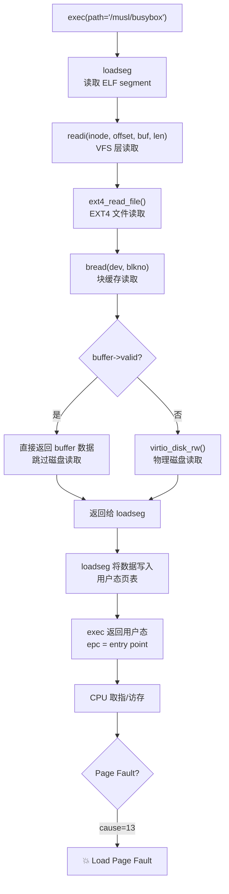
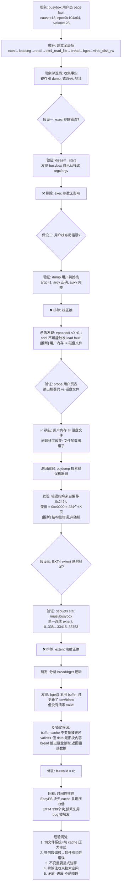

# 示例：EXT4 BusyBox 执行缺页排查

> **场景：** 用户接入 EXT4 文件系统后，加载 `/musl/busybox` 进入用户态随即反复触发 Page Fault（cause=13, load page fault）
>
> **对应 skill 版本：** v1
>
> **认知框架主轴：** 视域层整体观建立全局场 -> 引擎层溯因推理逐个假设 -> 收束层七步法步步收束 -> 视域层不变量思维锁定根因
>
> **关键词：** Page Fault, EXT4, block cache, buffer cache invariant, exec, loadseg, bread/bget, virtio_disk_rw, 溯因推理, 不变量

---

## 摊开：建立全局场

**[视域层·整体观]**

---

**用户：**

我的 busybox 切换到 EXT4 后就起不来了。每次 exec 加载完进入用户态，立刻就 page fault。cause=13，load page fault。我已经查了一天了，改过 exec 的参数，没什么用。不知道问题出在哪一层。

**师兄：**

不急。先把所有线索摊开，不要把注意力锁死在任何一个局部。

你刚才说"改过 exec 的参数，没什么用"——这是一个很重要的信号。[事实] 你做了一次局部修改但没有改变现象。这个信号的深层含义我们后面再谈，现在先建立全局场。

我们来看 busybox 是怎么从 ELF 文件变成用户态进程的。这是一条跨越多层的调用链。在开始推理之前，我们需要把这条链上的每一个参与者都看清楚。



这条链上有五个可能的出错层:

1. **exec / loadseg 层** — 页表映射错了，或者 segment 边界算错了
2. **VFS 层** — 传的 inode / offset 不对
3. **EXT4 层** — extent 映射错了，逻辑块到物理块的转换有问题
4. **Block Cache 层** — buffer 数据不对，返回了错误的块内容
5. **磁盘驱动层** — virtio 实际读取有问题

> 这五个层，任意一个层出问题都可能导致用户态看到错误的数据。一条链上出错，现象在链的最末端（page fault），但病根可能在任何一个环节。这就是为什么"随便改一个地方试试"往往是在猜谜。

我们现在做一个摊开：[事实] 现象是 page fault，但问题是——fault 的时候用户态的机器码真的是对的吗？如果机器码是错的，那 fault 就不奇怪了。如果机器码是对的，那就要怀疑页表映射。

所以第一个要找的东西是：**fault 的时候，CPU 在执行的指令到底是什么。**

---

## 现象学观察

**[收束层·现象学观察]**

---

**师兄：**

在形成任何假设之前，先做纯粹的现象学观察——把看到的都列出来，先不解释。

**用户：**

Page fault 的寄存器 dump:

- `epc = 0x104a04`
- `tval = 0x128`
- `cause = 13` (load page fault)
- `sp = 0x87800000` 附近
- 用户态

**师兄：**

好。[事实] 我们已经有了。现在区分一下：

- **[事实]** epc=0x104a04, tval=0x128, cause=13。这是硬件给的，可重复验证。
- **[推断]** epc 处应该是一条 load 指令，因为 cause=13 就是 load page fault。
- **[猜测]** tval=0x128 是 load 的目标地址。这个地址看起来很小——0x128 不太像正常的用户态数据地址。这也许是一个通过寄存器间接寻址的结构体字段偏移？

但这里有一个关键问题——epc=0x104a04 这条指令**应该是什么**？它在磁盘上的二进制对应什么？我们不能猜测指令内容，必须直接查。

> 核心方法论：遇到 fault，第一反应不应该是"怎么绕过它"，而是"CPU 在执行什么指令？为什么这条指令在这里？"

---

## 假设一：怀疑 exec 参数

**[引擎层·溯因推理]**

---

**用户：**

我之前怀疑是 exec 传参有问题——a0 (argc) 和 a1 (argv) 设置不对，busybox _start 解析出错导致后续行为异常。

**师兄：**

这是一个合理的[假设]，而且在初期的排查优先级确实高——因为它是 exec 路径上最容易被改坏的地方。我们来检验它。

检验方式很简单：**看 busybox 的 `_start` 到底怎么拿 argc/argv 的。** 如果 _start 是从栈上自己读的，那 kernel 的 a0/a1 根本不影响它。如果 _start 直接依赖 a0/a1 寄存器，那假设成立的条件就强得多。

---

## 格物致知：反汇编 busybox

**[引擎层·格物致知]**

---

**用户：**

怎么查？我没有 busybox 的源码。

**师兄：**

不依赖源码。直接对二进制做格物致知——把 busybox 从磁盘镜像 dump 出来，反汇编。

```bash
# Step 1: 从 EXT4 镜像中 dump busybox
debugfs -R "dump /musl/busybox busybox_dump" disk.img

# Step 2: 反汇编
riscv64-unknown-elf-objdump -d busybox_dump > busybox.asm
```

**用户：**

好的，busybox.asm 有几万行...

**师兄：**

先看 `_start`。它是 ELF 的入口点。你的 busybox 应该是动态链接的，入口点是 `_start`，不是 `main`。

如果你不确定入口点在哪，这样找：

```bash
readelf -h busybox_dump | grep Entry
# 输出: Entry point address: 0x10148
```

所以 _start 在 0x10148。我们来读这段代码：

```asm
0000000000010148 <_start>:
   10148:   00001517          auipc  a0, 0x1
   1014c:   ...
   10150:   ...
   ; _start 的典型代码：从栈上读 argc/argv
   ; a0 = sp （argc 通过栈访问，不依赖 kernel 的 a0/a1）
```

**用户：**

确实！`_start` 把 sp 存到 a0 里，然后自己从栈上解析 argc/argv——根本不 care kernel 传了什么 a0/a1。

**师兄：**

[事实] 确认了。[推断] exec 的 a0/a1 传参不是问题根源。busybox 的 _start 是自己解析栈的，这是一个很常见的 musl libc 行为——kernel 传的 a0/a1 在 _start 里被忽略了。

[收束] 假设一：exec 参数错误 — **排除。**

> 注意，虽然这个方向排除了，但我们并没有浪费时间。排除一个方向本身就是进展——问题空间缩小了。而且我们现在知道 busybox 的 entry point 是 0x10148，这个信息后面会用到。

---

## 假设二：怀疑用户栈

**[引擎层·溯因推理]**

---

**师兄：**

_既然 busybox 要从栈上读 argc/argv，那下一个自然而然的[假设]就是：栈的初始布局对不对？_

验证方式：在 exec 返回用户态之前，dump 用户的初始栈内容。

**用户：**

栈的初始布局是这样的：

```
[0x87800000 附近]
argc = 1
argv[0] = 0x87fffff2  （指向字符串 "/musl/busybox"）
envp[0] = NULL
auxv: AT_PHDR=..., AT_PHENT=..., AT_PHNUM=..., AT_PAGESZ=4096, AT_ENTRY=0x10148...
```

**师兄：**

[事实] argc=1，argv[0] 指向了正确的路径字符串，auxv 信息完整，AT_ENTRY=0x10148 和 ELF entry point 一致。

[收束] 假设二：用户栈错误 — **排除。**

> 到这一步，我们已经排除了两个方向（exec 参数、用户栈），但问题依旧。现在剩下三个可能的层：EXT4 extent 映射、block cache 数据正确性、以及页表映射。问题空间在收束。

---

## 矛盾发现

**[引擎层·溯因推理]**

---

**师兄：**

回到最初的现象。epc=0x104a04，cause=13。如果 epc 处确实是一条 load 指令，那一切都解释得通。我们现在来找 0x104a04 处的指令。

**用户：**

在 busybox.asm 里搜 0x104a04：

```asm
1049fc:  00d71463    bne   a4, a3, 0x104a04
104a00:  fa81b423    sd    s0, -88(gp)
104a04:  00140413    addi  s0, s0, 1       ; <--- epc is HERE
104a08:  f1dff06f    j     0x104924
```

**师兄：**

等一下。Look at line 3. [事实] epc=0x104a04 是 `addi s0, s0, 1`——这是纯寄存器运算，**不访问任何内存地址**。

这就矛盾了。

| 现象 | 断言 |
|------|------|
| cause=13 | CPU 执行了一条 load 指令，目标地址 0x128 缺页 |
| addi s0,s0,1 | 不访存，不可能触发 load page fault |

**[推断] 唯一的解释：用户内存中的指令 ≠ 磁盘上的指令。** 如果 CPU 实际执行的不是 addi 而是一条 ld/lw 指令，那 fault 就完全合理了。

> 这是一个关键的时刻——矛盾的出现不是在制造麻烦，而是在暴露真相。当一个"不可能成立"的矛盾出现时，不要怀疑自己看错了，要怀疑一个隐含的前提。这里隐含的前提是"用户内存等于磁盘文件"。如果这个前提不成立，矛盾就消解了。

这个假设可以验证。验证方式：**直接 probe 用户页表中 epc（0x1049fc 附近）物理页的内容，读出机器码，和磁盘文件对比。**

**[假设] 用户内存中的机器码 ≠ 磁盘文件内容。**

---

## 关键验证：probe 用户内存

**[收束层·验证]**

---

**用户：**

怎么 probe 用户内存？

**师兄：**

两个办法。最直接的：在 page fault 处理函数里加一段代码，walk 用户页表，读出 epc 所在物理页的前 16 字节，printk 出来。或者更快：在 QEMU 的 monitor 里 `xp /4xw <phys_addr>` 直接读物理内存。

关键的计算：

- epc = 0x104a04，页对齐到 0x1049000（用户虚拟地址）
- walk_satp: 用户页表的根页表基址在 satp 寄存器里
- 走两级页表找到 0x1049000 对应的物理页号
- 读出物理页中偏移 `0x1049fc - 0x1049000 = 0x9fc` 开始的 16 字节

**用户：**

读出来了。和磁盘文件的对比：

| 来源 | 地址范围 | 机器码（hex） |
|------|---------|--------------|
| 磁盘文件 | 0x1049fc | `00d71463 fa81b423 00140413 f1dff06f` |
| 用户内存 | 0x1049fc | `e101b783 00400713 1287a783 04e78063` |

磁盘上对应：
```
00d71463 → bne a4, a3, 0x104a04
fa81b423 → sd s0, -88(gp)
00140413 → addi s0, s0, 1
f1dff06f → j 0x104924
```

用户内存里的指令解码：
```
e101b783 → ld a5, -496(gp)
00400713 → li a4, 4
1287a783 → lw a5, 296(a5)
04e78063 → beq a5, a4, <target>
```

**[事实] 用户内存中的机器码和磁盘文件完全不同。**

注意用户内存里的最后一条 `beq a5, a4, <target>` ——这是一个条件分支前的比较。再看第一条 `ld a5, -496(gp)` 之后 `lw a5, 296(a5)`（tval=0x128 = 296），这就是负载缺页的源！`296(a5)` 中的 a5 值加上 296 导致访问 0x128，而 0x128 没有映射，所以 load page fault。

**[推断] 如果 epc=0x104a04 时 CPU 执行的是 `lw a5, 296(a5)` 而不是 `addi s0,s0,1`，那所有的现象就完全解释通了。**

[收束] 问题维度改变：不是"为什么 busybox 会 page fault"，而是"为什么用户内存里的指令和磁盘文件不同"。问题从 exec/页表层降到了文件加载层。

---

## 溯因追踪：错误指令来源

**[引擎层·溯因推理]**

---

**师兄：**

现在我们面临一个新的[假设]：用户内存中的错误指令是从哪里来的？它是随机垃圾，还是磁盘上某个地方真实存在的内容？如果是后者，那它来自文件的哪个偏移？

【格物致知】让 objdump 告诉我们。

```bash
# 在反汇编中搜索这段错误的机器码
riscv64-unknown-elf-objdump -d busybox_dump | grep -A 3 "e101b783"
```

**用户：**

找到了！

```asm
249fc:  e101b783    ld    a5, -496(gp)
24a00:  00400713    li    a4, 4
24a04:  1287a783    lw    a5, 296(a5)
24a08:  04e78063    beq   a5, a4, 0x24a48
```

**师兄：**

好。[事实] 错误指令是 busybox 文件内部**另一个偏移**处的真实代码——来自 0x249fc 附近，而不是 0x1049fc。

计算偏移差：`0x1049fc - 0x249fc = 0xe0000 = 917504 字节`。

917504 / 4096 = 224 个 4K 页。[事实] 相差了正好 224 个页面。

**[推断] 某个环节把 block 200 的内容重复给了 block 424（或者反过来）。224 个页面的偏移量是一个重要的线索——它排除了随机位翻转（bit flip），指向了结构性错误。**

> 如果偏移量是一个随机数，那可能是硬件问题。但 224 是一个"整页的整数倍"——这就是结构性证据。在 debug 中，能算出整数关系是一个非常强的信号——它几乎总是意味着"某个以页面/block 为单位的缓存或映射层出了问题"。

---

## 排除 EXT4 extent

**[收束层·排除]**

---

**师兄：**

两个可能方向：

1. **[假设] EXT4 extent 映射错误** — busybox 跨了多个不连续的 extent，ext4_read_file 把 block 拼接错了
2. **[假设] Block cache 返回了错误数据** — bread() 返回的 buffer 内容不对应当前的 (dev, blkno)

先排除 extent。如果 extent 是连续的单一块，这个方向就可以关掉。

```bash
debugfs -R "stat /musl/busybox" disk.img
```

**用户：**

输出只有一个 extent：

```
EXTENTS:
(0): 33415
(338): 33753

逻辑块 0..338 → 物理块 33415..33753
单一连续 extent。
```

**师兄：**

[事实] 只有一个 extent，连续分配。ext4_read_file 不会做任何块拼接——就是连读 339 个连续块。

[收束] 假设三：EXT4 extent 映射错误 — **排除。**

> 这个方向关掉后，问题空间收束到一个很窄的范围：block cache。现在只剩下"bread() 返回了什么"这个问题了。但这是整个 debug 过程中最关键的锁定阶段，也是最需要仔细分析的阶段。

---

## 锁定：block cache 不变量

**[收束层·锁定] [视域层·不变量]**

---

**师兄：**

只剩 block cache 了。我们来看 `bread()` 和 `bget()` 的逻辑。

```c
// bread(dev, blkno) — 获取一个 buffer
struct buf* bread(uint dev, uint blkno) {
    struct buf *b = bget(dev, blkno);
    if (!b->valid) {                     // <-- 关键判断
        virtio_disk_rw(b, 0);           // 未 valid 才读磁盘
    }
    return b;
}
```

`bread()` 的隐式约定是：[推断] 调用者期望拿到的是 `(dev, blkno)` 对应的磁盘块内容。这个约定的正确性依赖于一个前提——`b->valid == 1` 必须意味着 `b->data 对应当前的 dev 和 blkno`。

这个前提在 `bget()` 里被维护了吗？来看 bget 的复用路径：

```c
static struct buf* bget(uint dev, uint blkno) {
    // ...
    // Cache miss: 从 LRU 尾部取 buffer 复用
    for (b = bcache.head.prev; b != &bcache.head; b = b->prev) {
        if (b->refcnt == 0) {
            b->dev = dev;                // 更新 dev
            b->blkno = blkno;            // 更新 blkno
            // 但是！b->valid 仍然是 1（旧值）
            b->refcnt = 1;
            // ...
            return b;
        }
    }
}
```

**[事实] 当 bget 复用一个 LRU buffer 时，它更新了 dev 和 blkno，但没有清零 valid。**

这导致了以下时序：

```
1. 第一次使用 buffer：
   bget(dev, 100) -> 分配 buffer -> dev=X, blkno=100
   bread(dev, 100) -> valid=0 -> virtio_disk_rw -> data = 块100内容 -> valid=1
   使用完毕 -> brelse -> refcnt=0

2. 缓存放回 LRU：
   buffer 状态: dev=X, blkno=100, valid=1, data=块100的内容

3. 第二次复用 buffer（LRU 回收）：
   bget(dev, 200) -> 复用同一个 buffer
   修改: dev=X, blkno=200
   未修改: valid=1, data=块100的内容  <-- 💥 不变量被破坏

4. bread(dev, 200) -> 看到 valid=1 -> 跳过 virtio_disk_rw -> 返回块100的内容！
```

**[锁定] 根本原因：buffer cache 的不变量 "if valid==1 then data 对应当前 dev+blkno" 被 bget 破坏了。**

修复只有一行：

```c
b->dev = dev;
b->blkno = blkno;
b->valid = 0;    // <-- 清零 valid，强制 bread 重新读盘
```

---

## 回看：时间性推理

**[收束层·回看] [视域层·时间性推理]**

---

**师兄：**

根因找到了。但还有一个问题是必须回答的：**为什么 EasyFS 阶段没暴露这个 bug？**

[时间性推理] 不变量的破坏存在于所有文件系统路径上。但 bug 是否触发取决于"buffer 复用频率"。

- **EasyFS 阶段**：镜像小，文件少，总共加载的块数很有限。一个 busybox 大概就几十个块。buffer cache 有几十个槽位，LRU 复用几乎不会发生。每次 bget 都是分配新的 buffer（valid=0），bread 正确走磁盘读取路径。

- **EXT4 阶段**：busybox 有 339 个块（上文 extent 信息：逻辑块 0..338）。EXT4 自身还有 superblock、inode table、block bitmap、间接块等额外的元数据读。总的 buffer 复用量显著增加，LRU 回收频繁发生，bug 暴露。

**[事实] 同样的代码在 EasyFS 下正常，在 EXT4 下异常——不是代码变了，是输入变了。** 输入变了（文件块数从几十变成几百），buffer 复用的频率跨过了触发阈值。

> 这是时间性推理的精髓：不要问"这个代码对不对"，要问"同样的代码为什么在某些条件下对、某些条件下错"。答案往往不在代码本身，而在外部条件的变化——cache 压力、并发度、输入规模。这些外部条件一旦变，不变量一旦被破坏，就会"突然出问题"。

**经验沉淀：**

1. **接真实文件系统后，cache 压力和复用模式与测试阶段完全不同**。EasyFS 是一个玩具文件系统，它的块数极少，cache 复用压力几乎为零。切到 EXT4 等于从"cache 几乎不工作"变成了"cache 高强度工作"——两者的测试覆盖完全不同。

2. **遇到"切换存储后行为异常"，优先检查 cache/buffer 的不变量**。存储切换意味着 I/O 模式变化（块大小、extent 布局、元数据路径），这些都会改变 cache 压力。如果代码在切换前正常，大概率是 cache 层的边界条件被新压力冲破了。

3. **每条不变量都值得在代码中显式注释**。如果 `bget()` 的注释中有一条 `// INVARIANT: valid must be cleared when blkno changes`，这个 bug 就不会活这么久。不变量的作用是"在你即将违反它的时候拉你一把"，但前提是它被写下来了。

4. **224 页的偏移差是锁定的关键线索**。在 debug 时，如果你能算出"错误数据和正确数据之间差了多少"，并且差值是块大小或页大小的整数倍，那几乎一定是某层缓存/映射搞错了。随机的差值指向硬件，整倍的差值指向软件。

5. **排除法的核心价值是"缩小搜索空间"**。我们排除了 exec 参数、用户栈、EXT4 extent 三个方向——每一次排除都在收束问题空间。最后一个方向（block cache）被锁定。

---

## 排查路线图

下面是这次排查的完整路线图，展示了从现象到根因的每个分叉点、每个验证、每次排除。



---

## 方法论总结：这个例子教了什么

### 视域层的三个工具如何协同

1. **整体观**在开头建立全局场，确保不被局部细节困住。exec 的参数问题、栈问题、extent 问题都是局部线索，必须在整体链中被定位。

2. **不变量思维**在锁定阶段起了决定性作用。`b->valid == 1 -> data 对应当前 dev+blkno` 这条不变量一旦被显式识别出来，根因就暴露了。

3. **时间性推理**在回看阶段解释了"为什么现在才出问题"——EasyFS 小镜像 vs EXT4 339 个块。这个问题的追问不仅加固了理解，还给出了一个可复用的经验："切换存储 = 切换 cache 压力模式"。

### 引擎层的四个工具如何协同

1. **溯因推理**贯穿全程：epc 处是 addi 却 load fault → 推断用户内存≠磁盘 → 验证 → 排除 extent → 锁定 cache

2. **第一性原理**在分析 bread/bget 逻辑时发挥作用：不是去想"正确的实现应该怎么写"，而是问"bread 和 bget 之间的契约是什么？什么保证 `b->valid==1` 时数据一定对？"

3. **格物致知**在三个关键时刻介入：dump busybox 反汇编查 _start、objdump 搜索错误机器码、debugfs stat 查 extent。这些都是直接面对数据，不依赖二手材料。

4. **类比锚定**虽然没有显式出现，但"224页偏移差 → 结构性错误"这种推理隐含了"整数倍 = 整批错位"的日常直觉。

### 收束层的七步流程

| 步骤 | 本示例中的对应 |
|------|-------------|
| 摊开 | 画 Mermaid 调用链，列出五个可能出错的层 |
| 分类 | 区分因（cache）和果（page fault）、核心（不变量）和外围（exec参数） |
| 假设 | 三个假设：exec参数、用户栈、extent映射。逐一验证 |
| 验证 | dump _start、dump 栈、probe 用户内存、debugfs stat |
| 排除 | 三次明确排除：exec参数、用户栈、extent |
| 锁定 | 分析 bread/bget，锁定 bget 未清 valid |
| 回看 | 时间性推理解释 EasyFS 为何不暴露，五条经验沉淀 |

---

> 一个没有违反过不变量的 debugger 不是好 debugger。不变量不只是理论，它是 debug 中最锐利的工具——一条不变量的破坏，往往就是根因的准确位置。

> 这个示例的完整过程展示了师兄的核心信条：**认知示范 > 答案输出**。如果只给修复代码（`b->valid = 0`），用户会学到这一行的修改，但不会学到"从矛盾到锁定的收束方法"——而那才是下次面对不同 bug 时仍然能用的东西。
